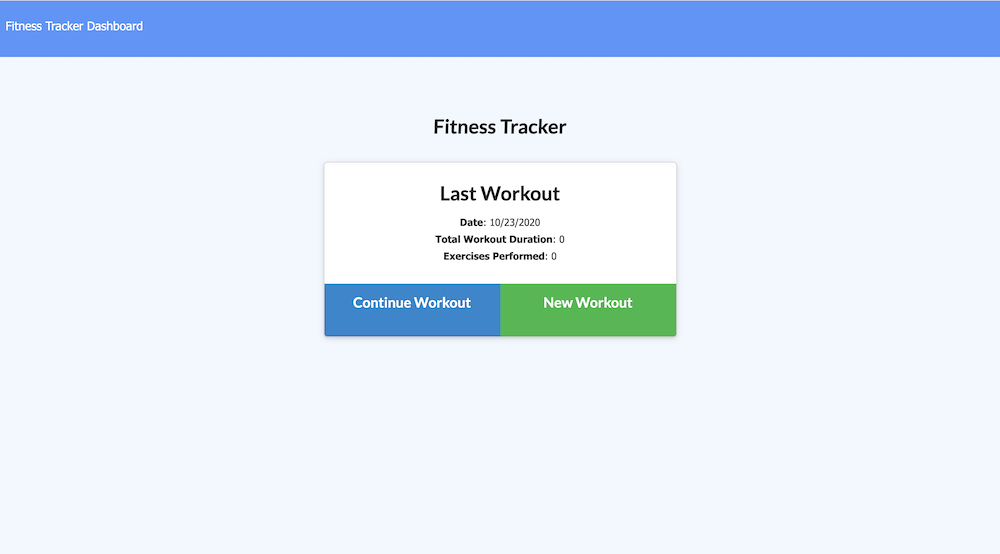
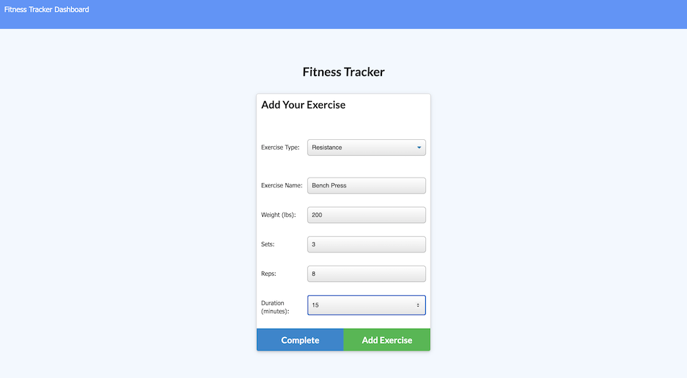
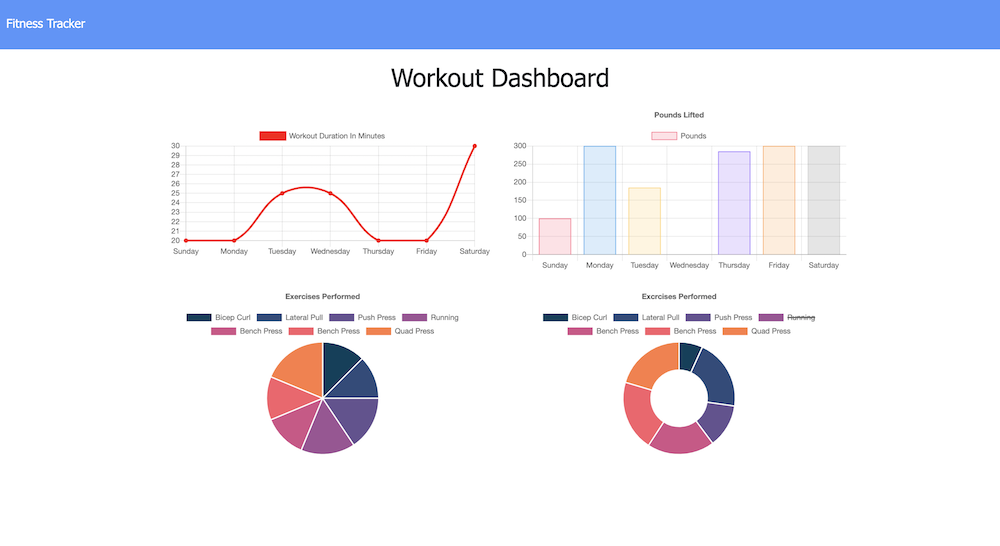

# Workout-Tracker

## Table of Contents
#### &nbsp;&nbsp;&nbsp;&nbsp;[1)&nbsp;Introduction](#introduction)
#### &nbsp;&nbsp;&nbsp;&nbsp;[2)&nbsp;Instructions](#instructions)
#### &nbsp;&nbsp;&nbsp;&nbsp;[3)&nbsp;Features](#features)
#### &nbsp;&nbsp;&nbsp;&nbsp;[4)&nbsp;Usage](#usage)
#### &nbsp;&nbsp;&nbsp;&nbsp;[5)&nbsp;Contributing](#contributing)
#### &nbsp;&nbsp;&nbsp;&nbsp;[6)&nbsp;License](#license)
#### &nbsp;&nbsp;&nbsp;&nbsp;[7)&nbsp;Questions](#questions)   

## Introduction 

The assignment here was to created a "Workout Tracker" which required the creation of a Mongo db with a Mongoose schema and handle routes with Express.  We were provided with all of the front end code and from there we had to create the models to mirror the seed data provided, write the server routes needed, and connect the database with Heroku.

## Instructions

Type NPM install in the terminal after cloning this repo and then NPM run seed to get the seed data to populate the database.  From there a user can either add a new workout by clicking on "New Workout", or continue the latest workout by clicking on "Continue Workout".  Choose from Cardio or Resistence in the "add your exercise" dropdown menu" and then populate the fields.  If adding another exercise to the workout from there, click on "Add Exercise, if complete click on Complete.

## Features

The business context here is that a user will reach their fitness goals more quickly when they track their workout progress.  Once a user starts tracking workouts on the app, each time they come back to the app they see the previous workout.  When a user clicks on the Dashboard link in the upper left they are taken to a "Workout Dashboard" where the user can view various charts showing a summary of the last 7 days of workouts, including which exercises were performed, how many pounds were lifted, along with the daily workout durations.

The app utilizes a virtual in order to calculate the total duration of a given workout even if a workout includes more than one exercise.  The total duration of the previous workout is displayed in the "Last Workout" stats.

## Usage

The URL for this project is https://workout-tracker-gt.herokuapp.com/

The URL for this project's GitHub repository is: https://github.com/7J647/Workout-Tracker

Users must remember to run "npm install" after cloning this repo.

## Contributing

With thanks to Head Coach Jonathan Watson and his team of TAs and to Josh Furlin for providing tutoring on this project. 

## License

MIT License

Copyright (c) 2020 Jeff Flynn

Permission is hereby granted, free of charge, to any person obtaining a copy
of this software and associated documentation files (the "Software"), to deal
in the Software without restriction, including without limitation the rights
to use, copy, modify, merge, publish, distribute, sublicense, and/or sell
copies of the Software, and to permit persons to whom the Software is
furnished to do so, subject to the following conditions:

The above copyright notice and this permission notice shall be included in all
copies or substantial portions of the Software.

THE SOFTWARE IS PROVIDED "AS IS", WITHOUT WARRANTY OF ANY KIND, EXPRESS OR
IMPLIED, INCLUDING BUT NOT LIMITED TO THE WARRANTIES OF MERCHANTABILITY,
FITNESS FOR A PARTICULAR PURPOSE AND NONINFRINGEMENT. IN NO EVENT SHALL THE
AUTHORS OR COPYRIGHT HOLDERS BE LIABLE FOR ANY CLAIM, DAMAGES OR OTHER
LIABILITY, WHETHER IN AN ACTION OF CONTRACT, TORT OR OTHERWISE, ARISING FROM,
OUT OF OR IN CONNECTION WITH THE SOFTWARE OR THE USE OR OTHER DEALINGS IN THE
SOFTWARE.

## Questions

Connect with me at Github: <a href="https://github.com/7J647">7J647</a> &nbsp;&nbsp;&nbsp;&nbsp;
Contact me via Email: [jeffreyedwardflynn@gmail.com](mailto:jeffreyedwardflynn@gmail.com)
